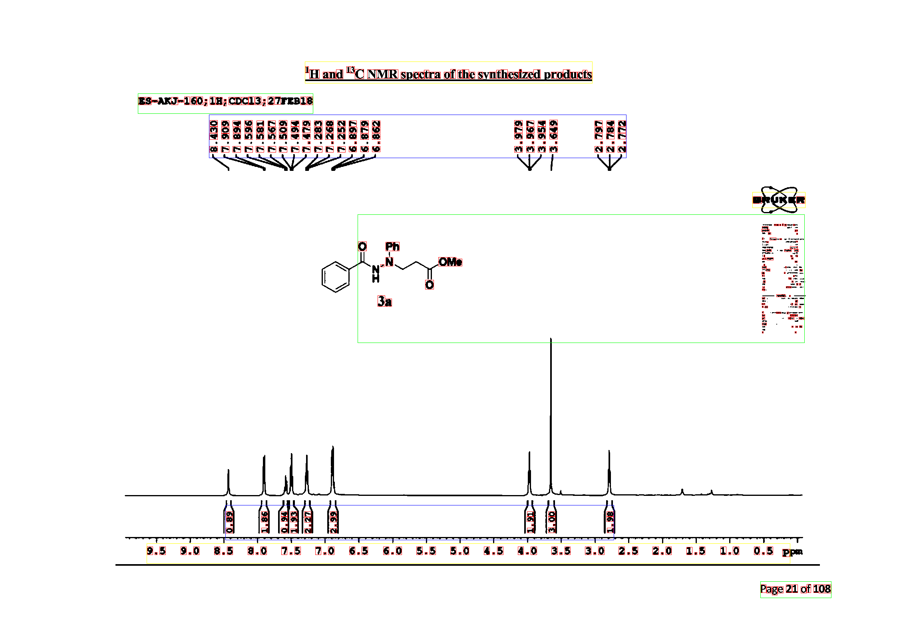

# CV_HW6 Report
- Name: Zhang Qi
- ID: 17343153
- Email: zhangq295@mail2.sysu.edu.cn

## 一、实验内容
> **【本次实验完成的是任务二】**
1. 根据给定的数据，自己做切割, 聚类, 人工标注, 获得印刷体的数据集。
2. 选取八张图片用作数据训练，另外选取八张图片用作数据测试。（注：此处与作业文档有出入，在实验中以曾坤老师在钉钉群中的发言为准）
3. 对所有图像完成作业 5 的步骤, 并给出测试报告和准确率对比。
4. 采用的方法分别是: SVM, Adaboost, KNN, XG-Boost. (4 个方法都做, 比较不同方法的效果)
- 思考: 直接用 MNIST 的训练模型来识别印刷体的图像, 如果识别准确率不高, 为什么?

## 二、实验环境
- Ubuntu 18.04
- C++11
- OpenCV 3.2
- CImg

## 三、实验过程及结果
### 1. 根据给定的数据，自己做切割, 聚类, 人工标注, 获得印刷体的数据集。
- 本次作业一共给了两组数据集（Ol9b：88张，TT035：30张），通过简单比较之后可以发现**Ol9b**中的图片数字比较多，可以从图片上截获更多的训练数据，从而能够让分类器更加准确，所以我选择从**Ol9b**中挑选八张图片进行采集数据。
- 获取的数据均通过旋转等方式让其保证为“头朝上”，实验中用到的训练数据存放在`digits_recognize/sample`文件夹下。

### 2. 使用四种方法对八张图片进行数据识别的测试。
完成情况如下:
- [x] KNN
- [x] SVM
- [x] Adaboost
- [ ] XG-Boost  

程序中对应的函数为`void recognize_numbers(vector<Rectan> nums_loc, vector<Rectan> dots_loc, int flag = KNN_FLAG);`
在头文件中，有四个宏定义分别对应四种方法（在上述参数列表中的`flag`中使用。）
```cpp
// recognize_numbers中的flag值
#define KNN_FLAG 0
#define SVM_FLAG 1
#define ADABOOST_FLAG 2
#define XGBOOST_FLAG 3
```

- KNN：
程序中对应的函数为：`Mat knn_recognize_nums(vector<Rectan> nums_loc, vector<Rectan> dots_loc)`
核心代码：
```cpp
	////===============================创建KNN模型===============================////
	Ptr<KNearest>knn = KNearest::create();
	knn->setDefaultK(10);//k个最近领
	knn->setIsClassifier(true);//true为分类，false为回归
	//训练数据和标签的结合
	Ptr<TrainData>trainData = TrainData::create(traindata, ROW_SAMPLE, clas);
	//训练
	knn->train(trainData);

        ////===============================预测部分===============================////
        float r = knn->predict(input);   //对所有行进行预测

```
因为使用了`OpenCV`中自带的方法，所以核心代码只有短短几行，而对于相关训练集的转化，以及从测试图片上截下识别的数字和相关的处理反而需要很多步骤。
部分实验结果如下（详情可见文件夹`digits_recognize/knn`）：

**Ol9b测试集：全部识别正确**


**TT035测试集：全部识别正确**


- SVM：
程序中对应的函数为：`Mat svm_recognize_nums(vector<Rectan> nums_loc, vector<Rectan> dots_loc)`
核心代码：
```cpp
	////===============================创建SVM模型===============================////
	// 创建分类器并设置参数
	Ptr<SVM> SVM_params = SVM::create();
	SVM_params->setType(SVM::C_SVC);//C_SVC用于分类，C_SVR用于回归
	SVM_params->setKernel(SVM::LINEAR);  //LINEAR线性核函数。SIGMOID为高斯核函数
 
	SVM_params->setDegree(0);//核函数中的参数degree,针对多项式核函数;
	SVM_params->setGamma(1);//核函数中的参数gamma,针对多项式/RBF/SIGMOID核函数; 
	SVM_params->setCoef0(0);//核函数中的参数,针对多项式/SIGMOID核函数；
	SVM_params->setC(1);//SVM最优问题参数，设置C-SVC，EPS_SVR和NU_SVR的参数；
	SVM_params->setNu(0);//SVM最优问题参数，设置NU_SVC， ONE_CLASS 和NU_SVR的参数； 
	SVM_params->setP(0);//SVM最优问题参数，设置EPS_SVR 中损失函数p的值. 
	//结束条件，即训练1000次或者误差小于0.01结束
	SVM_params->setTermCriteria(TermCriteria(TermCriteria::MAX_ITER + TermCriteria::EPS, 1000, 0.01));
 
	//训练数据和标签的结合
	Ptr<TrainData> tData = TrainData::create(traindata, ROW_SAMPLE, clas);
 
	// 训练分类器
	SVM_params->train(tData);//训练
 
	//保存模型
	SVM_params->save("./digits_recognize/svm/svm数字识别.xml"); 

	////===============================预测部分===============================////

        float r = SVM_params->predict(input);  //对所有行进行预测
```
与KNN相比，SVM需要设置的参数就比较多了。这样带来一个好处就是SVM的泛化能力比较强，能够适应很多不同的情况，但是在调参过程中就比较麻烦。不过svm可以产生一个xml文件，只需要训练一次就可以将特征保存在这个文件中，再之后的使用就可以直接从该文件中读取进行分类，而无需重复训练。
部分实验结果如下（详情可见文件夹`digits_recognize/svm`）：

**Ol9b测试集：全部识别正确**


**TT035测试集：大约十个左右“2”没有识别正确，个别“8”被误判成“3”，准确率约98%**


- AdaBoost:
程序中对应的函数为：`Mat adaboost_recognize_nums(vector<Rectan> nums_loc, vector<Rectan> dots_loc)`
核心代码：
```cpp
	// 训练正样本
	for (int i = 0; i < all_num; i++)//依次循环遍历每个文件夹中的图片
	{
		cvtColor(imread(input_images_name[i]), sample_gray, COLOR_BGR2GRAY);//灰度变换          
		resize(sample_gray,sample_gray,Size(img_size_width,img_size_height));
		threshold(sample_gray, sample_binary, 0, 255, THRESH_OTSU);//二值化
					
		//循环读取每张图片并且依次放在vector<Mat> input_images内
		input_images.push_back(sample_binary);
		deal_img = input_images[i];

		//注意：我们简单粗暴将整个图的所有像素作为了特征，因为我们关注更多的是整个的训练过程
		//，所以选择了最简单的方式完成特征提取工作，除此中外，
		//特征提取的方式有很多，比如LBP，HOG等等
		//我们利用reshape()函数完成特征提取,
		//eshape(1, 1)的结果就是原图像对应的矩阵将被拉伸成一个一行的向量，作为特征向量。 
		deal_img = deal_img.reshape(1, 1);//图片序列化
		training_data.push_back(deal_img);//序列化后的图片依次存入
		labels.push_back(label);//把每个图片对应的标签依次存入
	}

        // 训练负样本
        for (int j = 0; j < class_num; ++j) {
            if(j!=label){
                oss << "./digits_recognize/sample/";
                int false_label = -1;
                oss << j << "/*.bmp";//图片名字后缀，oss可以结合数字与字符串
                string pattern = oss.str();//oss.str()输出oss字符串，并且赋给pattern
                oss.str("");//每次循环后把oss字符串清空
                
                //为false时，仅仅遍历指定文件夹内符合模式的文件，当为true时，会同时遍历指定文件夹的子文件夹
                //此时input_images_name存放符合条件的图片地址
                glob(pattern, input_images_name, false);
            
                all_num = input_images_name.size();

                for (int i = 0; i < all_num; i++)//依次循环遍历每个文件夹中的图片
                {
                    cvtColor(imread(input_images_name[i]), sample_gray, COLOR_BGR2GRAY);//灰度变换          
                    resize(sample_gray,sample_gray,Size(img_size_width,img_size_height));
                    threshold(sample_gray, sample_binary, 0, 255, THRESH_OTSU);//二值化
                                
                    //循环读取每张图片并且依次放在vector<Mat> input_images内
                    input_images.push_back(sample_binary);
                    deal_img = input_images[i];
         
                    deal_img = deal_img.reshape(1, 1);//图片序列化
                    training_data.push_back(deal_img);//序列化后的图片依次存入
                    labels.push_back(false_label);//把每个图片对应的标签依次存入
                }
            }
        }

		//创建训练数据
        Ptr<TrainData> tdata = TrainData::create(traindata, ROW_SAMPLE, clas);

        //算法类型
        model[p]->setBoostType(Boost::GENTLE);
        //弱分类器的数量
        model[p]->setWeakCount(100);
        //0和1之间的阈值
        model[p]->setWeightTrimRate(0.95);
        //树的最大可能深度
        // model[p]->setMaxDepth(5);
        //是否建立替代分裂点
        model[p]->setUseSurrogates(false);
        //先验类概率数组
        // model->setPriors(Mat(priors));

        //训练模型
        model[p]->train(tdata);
        ////将分类器保存到文件中
        model[p]->save( "./digits_recognize/adaboost/adaboost数字识别_" + to_string(p)+".xml" );

	// --------- 预测---------
	int r = 0;
        for (r; r < 10; ++r) {
            if(model[r]->predict(input) == r)
                break;
        }
        if (r == 10) r = -1;

```
因为AdaBoost是一个二分类的分类器，所以并不能像KNN和SVM那样直接见数字与label进行一一匹配地训练，而是对于**每一个数字都需要进行正负样本的训练**。在实验中，我一共训练了十个分类器，存放在数组`model[10]`中。对于每一格分类器（index即为lable），将本数字的训练数据作为正样本，其他九个数字的训练数据作为负样本，从而得到对应数字的分类器。
在进行预测的时候就从分类器0~9进行遍历，如果某个分类器“判对”，则跳出循环，对应的索引即为输入图片对应的数字。若没有匹配的数字，则输出为-1.

部分实验结果如下（详情可见文件夹`digits_recognize/adaboost`）：

**Ol9b测试集：全部识别正确**


**TT035测试集：很大部分不正确**


通过分析，我对这个实验结果的解释为：
- 训练样本全部截取于**Ol9b**，与**TT035**中的数字存在一定的区别。
- 所使用的特征是将二值图像“投影”到一行上，从而进行比较。这个特征受“旋转”、“Resize”的影响比较大。可以考虑其他特征提取的方法，比如LBP，HOG等等
- 使用的AdaBoost是由十个二分类的分类器级联而成的，可能对于“新事物”的判断能力比较弱。

### 3.对所有图片进完成任务五的内容
> **因为实验五已经提交过一次实验报告，本次作业是在作业五的基础上更新完成的，所以本步骤不再讨论详细内容。**
> 
#### （1） 数字、小数点切割+分区
程序中对应的函数为`vector<vector<Rectan>> cut(vector<Rectan>needed_rectan,vector<Rectan> &range, CImg<uchar> &output)`
部分实验结果如下（详情可见文件夹`nums_dots_blocks`）：
**Ol9b测试集：**


**TT035测试集：**


#### （2） 括号在坐标轴上的数据：
程序中对应的函数为`void bracket(CImg<uchar> img)`
因为坐标轴每个单元格对应的像素值（长度）并不同意，于是我在程序中只能够求整个坐标轴的平均值，所以对于部分数据来说可能从肉眼上看差别有点大。
部分实验结果如下（详情可见文件夹`brackets`）：
**Ol9b测试集：**


**TT035测试集：**


### 4.思考: 直接用 MNIST 的训练模型来识别印刷体的图像, 如果识别准确率不高, 为什么?
> 因为MNIST中的模型为手写字体，存在较大的“随意性”。假设印刷体是“标准字体”，那么手写体就相当于是在标准字体上加上一个“噪声”，所以需要比较大的训练集才能够“刚好抵消掉噪声带来的影响”，从而得到一个比较接近标准字体的分类器。所以直接用 MNIST 的训练模型来识别印刷体的图像效果并不理想。 